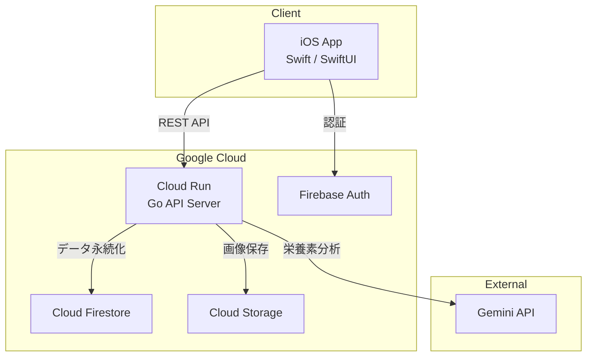

# AI体重管理・カロリー計算アプリ

AIによる体重管理・カロリー計算の実用性を検証するために開発したiOSアプリ。
Gemini APIのマルチモーダル機能を活用し、食事の写真や自然言語入力からカロリー・栄養素（PFC）を自動算出する。体重推移の可視化や栄養目標の管理機能も備える。

## 主な機能

- 食事画像のAI栄養素分析（Gemini API）
- 体重記録・推移グラフ
- 栄養目標設定（PFCバランス）
- 運動記録・消費カロリー推定
- 食事・体重リマインダー通知

## 技術スタック

| レイヤー | 技術 |
|:---|:---|
| iOS | Swift / SwiftUI |
| バックエンド | Go 1.25 |
| AI | Gemini API |
| データベース | Cloud Firestore |
| ストレージ | Cloud Storage |
| インフラ | Cloud Run / Terraform |
| 認証 | Firebase Authentication（Google Sign-In） |
| CI/品質管理 | Lefthook / golangci-lint / SwiftLint |

## アーキテクチャ



## ディレクトリ構成

```
utikomi/
├── backend/             # Go バックエンド
│   ├── cmd/server/      # エントリーポイント
│   ├── internal/        # handler / service / repository / middleware
│   └── pkg/             # gemini / database / storage
├── ios/                 # iOS アプリ（SwiftUI）
│   ├── Uchikomi/        # Features / Core / Resources
│   └── UchikomiCore/    # コアフレームワーク
├── infrastructure/      # Terraform（GCP）
└── docs/                # ドキュメント・ADR
```